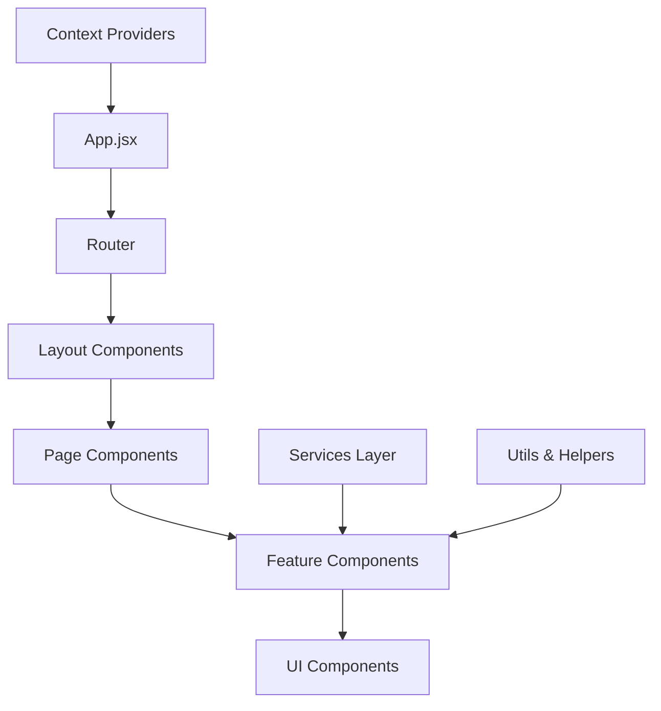
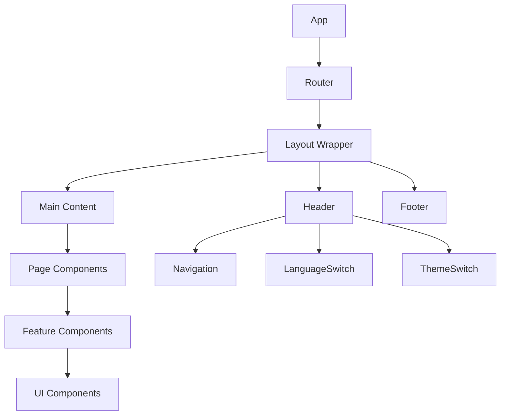
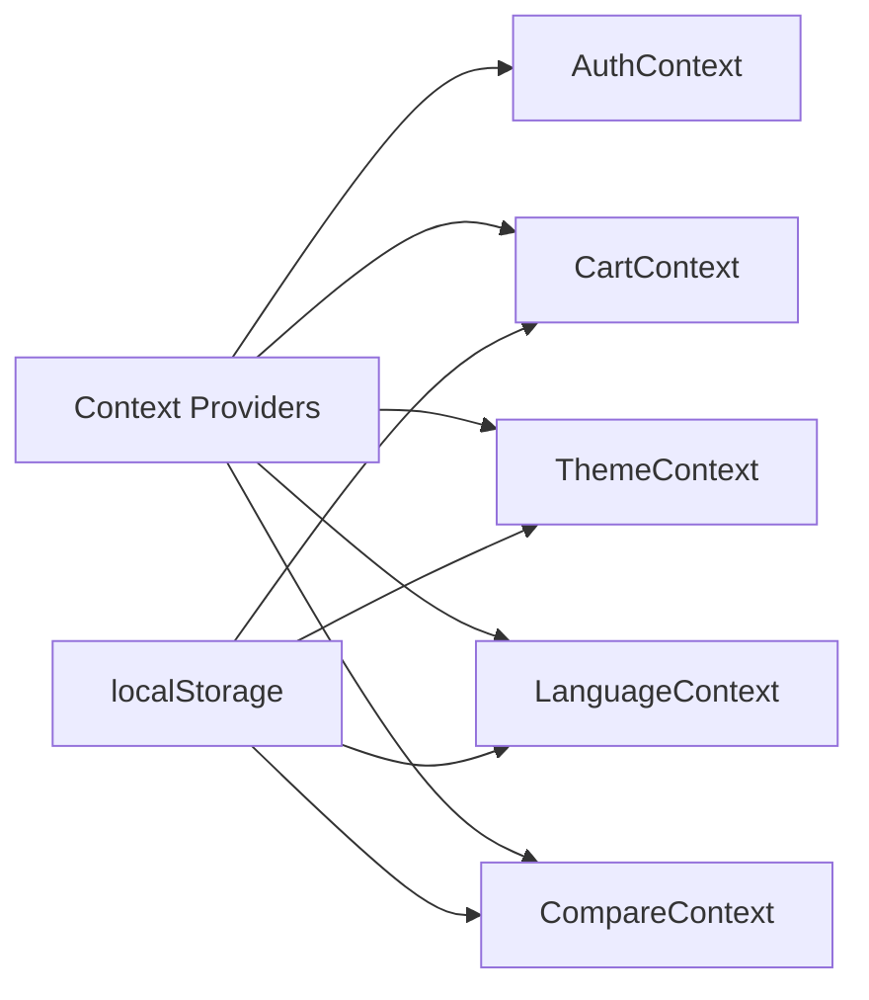

# 🎨 BabyChic Cameroun - Architecture Frontend

> **Documentation complète de l'architecture React** - Structure, patterns et bonnes pratiques

---

## 📋 Table des Matières

1. [Vue d'Ensemble](#vue-densemble)
2. [Structure du Projet](#structure-du-projet)
3. [Architecture des Composants](#architecture-composants)
4. [Gestion d'État](#gestion-état)
5. [Routing et Navigation](#routing-navigation)
6. [Services et API](#services-api)
7. [Internationalisation](#internationalisation)
8. [Theming et Styles](#theming-styles)
9. [Performance et Optimizations](#performance)
10. [PWA et Offline](#pwa-offline)
11. [Tests et Quality](#tests-quality)

---

## 🌐 Vue d'Ensemble

BabyChic Frontend est une **Single Page Application (SPA)** moderne construite avec :

### Stack Technique Principal

- **React 18** : Framework UI avec Hooks et Concurrent Features
- **Vite** : Build tool ultra-rapide avec HMR
- **Tailwind CSS** : Framework CSS utilitaire avec design system
- **React Router** : Navigation côté client
- **Context API** : Gestion d'état globale
- **Axios** : Client HTTP pour API calls
- **React i18next** : Internationalisation FR/EN
- **React Query** : Cache et synchronisation serveur (optionnel)

### Principes d'Architecture



### Philosophie de Développement

- **Component-First** : Tout est composant réutilisable
- **Context over Props Drilling** : État global via Context API
- **Mobile-First** : Design responsive priorité mobile
- **Performance-Focused** : Code splitting et lazy loading
- **Accessibility-Ready** : WCAG 2.1 compliance
- **TypeScript Ready** : Architecture préparée pour migration TS

---

## 📁 Structure du Projet

### Arborescence Complète

```
babychic-frontend/
├── public/                          # Assets statiques
│   ├── icons/                      # Icônes de paiement et autres
│   │   ├── mtn.jpeg
│   │   ├── om.png
│   │   └── striper.jpeg
│   ├── avarta/                     # Avatars par défaut
│   ├── logo.png                    # Logo principal
│   ├── manifest.json               # PWA manifest
│   ├── robots.txt                  # SEO robots
│   └── favicon.ico                 # Favicon
│
├── src/                            # Code source principal
│   ├── components/                 # Composants réutilisables
│   │   ├── Layout/                # Composants de mise en page
│   │   │   ├── Header.jsx         # En-tête avec navigation
│   │   │   ├── Footer.jsx         # Pied de page
│   │   │   ├── LanguageSwitch.jsx # Commutateur de langue
│   │   │   └── ThemeSwitch.jsx    # Commutateur de thème
│   │   ├── Product/               # Composants produit
│   │   │   ├── ProductCard.jsx    # Carte produit
│   │   │   └── CompareModal.jsx   # Modal de comparaison
│   │   ├── Cart/                  # Composants panier
│   │   │   └── [à développer]
│   │   ├── Admin/                 # Composants administration
│   │   │   └── [à développer]
│   │   ├── Newsletter/            # Newsletter
│   │   │   └── NewsletterSubscribe.jsx
│   │   └── Search/                # Recherche
│   │       └── VoiceSearch.jsx    # Recherche vocale
│   │
│   ├── pages/                     # Pages principales (Routes)
│   │   ├── Home.jsx              # Page d'accueil
│   │   ├── About.jsx             # À propos
│   │   ├── Contact.jsx           # Contact
│   │   ├── Catalog.jsx           # Catalogue produits
│   │   ├── ProductDetail.jsx     # Détail produit
│   │   ├── Cart.jsx              # Panier
│   │   ├── Checkout.jsx          # Commande
│   │   ├── OrderSuccess.jsx      # Confirmation commande
│   │   └── Admin/                # Pages admin
│   │       ├── AdminDashboard.jsx
│   │       ├── AdminLogin.jsx
│   │       ├── AdminProducts.jsx
│   │       └── AdminOrders.jsx
│   │
│   ├── context/                  # Gestionnaires d'état globaux
│   │   ├── AuthContext.jsx       # Authentification
│   │   ├── CartContext.jsx       # Panier shopping
│   │   ├── ThemeContext.jsx      # Thème sombre/clair
│   │   ├── LanguageContext.jsx   # Langue FR/EN
│   │   └── CompareContext.jsx    # Comparaison produits
│   │
│   ├── services/                 # Services et API clients
│   │   ├── api.js                # Configuration Axios
│   │   ├── auth.js               # Services authentification
│   │   ├── products.js           # Services produits
│   │   ├── orders.js             # Services commandes
│   │   └── payments.js           # Services paiements
│   │
│   ├── utils/                    # Utilitaires et helpers
│   │   ├── notifications.js      # Système de notifications
│   │   ├── validators.js         # Validateurs de formulaires
│   │   ├── formatters.js         # Formatage données
│   │   ├── constants.js          # Constantes application
│   │   └── helpers.js            # Fonctions utilitaires
│   │
│   ├── i18n/                     # Internationalisation
│   │   ├── index.js              # Configuration i18next
│   │   └── locales/              # Fichiers de traduction
│   │       ├── fr/
│   │       │   └── translation.json
│   │       └── en/
│   │           └── translation.json
│   │
│   ├── styles/                   # Styles globaux (si nécessaire)
│   │   ├── globals.css           # Styles globaux
│   │   └── components.css        # Styles composants
│   │
│   ├── hooks/                    # Custom React Hooks
│   │   ├── useAuth.js            # Hook authentification
│   │   ├── useCart.js            # Hook panier
│   │   ├── useLocalStorage.js    # Hook localStorage
│   │   └── useApi.js             # Hook API calls
│   │
│   ├── assets/                   # Assets importés
│   │   ├── images/               # Images dans le bundle
│   │   ├── icons/                # Icônes SVG
│   │   └── react.svg             # Logo React par défaut
│   │
│   ├── App.jsx                   # Composant principal
│   ├── App.css                   # Styles App
│   ├── main.jsx                  # Point d'entrée React
│   └── index.css                 # Styles Tailwind + globaux
│
├── doc/                          # Documentation
│   ├── Architecture_Frontend.md  # Ce document
│   ├── Components_Guide.md       # Guide des composants
│   ├── Development_Guide.md      # Guide de développement
│   └── Deployment_Guide.md       # Guide de déploiement
│
├── .env.example                  # Variables d'environnement
├── .gitignore                    # Git ignore rules
├── eslint.config.js              # Configuration ESLint
├── index.html                    # HTML principal
├── netlify.toml                  # Configuration Netlify
├── package.json                  # Dépendances et scripts
├── postcss.config.js             # Configuration PostCSS
├── tailwind.config.js            # Configuration Tailwind
└── vite.config.js                # Configuration Vite
```

---

## 🏗️ Architecture des Composants

### Hiérarchie des Composants



### Types de Composants

#### 1. **Layout Components** (`src/components/Layout/`)

Composants de structure globale de l'application.

```jsx
// Header.jsx - Navigation principale
const Header = () => {
  const { user } = useAuth();
  const { cartItems } = useCart();
  const { t } = useTranslation();

  return (
    <header className="bg-white dark:bg-gray-900 shadow-sm">
      <nav className="container mx-auto px-4 py-4">
        {/* Logo */}
        <Link to="/" className="flex items-center">
          
        </Link>

        {/* Navigation Links */}
        <div className="hidden md:flex space-x-8">
          <NavLink to="/" className="nav-link">{t('nav.home')}</NavLink>
          <NavLink to="/catalog" className="nav-link">{t('nav.catalog')}</NavLink>
          <NavLink to="/about" className="nav-link">{t('nav.about')}</NavLink>
          <NavLink to="/contact" className="nav-link">{t('nav.contact')}</NavLink>
        </div>

        {/* Actions */}
        <div className="flex items-center space-x-4">
          <LanguageSwitch />
          <ThemeSwitch />
          <CartIcon count={cartItems.length} />
          {user && <UserMenu user={user} />}
        </div>
      </nav>
    </header>
  );
};
```

#### 2. **Page Components** (`src/pages/`)

Composants de pages complètes correspondant aux routes.

```jsx
// Home.jsx - Page d'accueil
const Home = () => {
  const { t } = useTranslation();
  const [featuredProducts, setFeaturedProducts] = useState([]);
  
  useEffect(() => {
    // Charger les produits vedettes
    loadFeaturedProducts();
  }, []);

  return (
    <div className="min-h-screen">
      {/* Hero Section */}
      <HeroSection />
      
      {/* Featured Products */}
      <section className="py-12">
        <div className="container mx-auto px-4">
          <h2 className="text-3xl font-bold text-center mb-8">
            {t('home.featured_products')}
          </h2>
          <ProductGrid products={featuredProducts} />
        </div>
      </section>
      
      {/* Newsletter */}
      <NewsletterSection />
    </div>
  );
};
```

#### 3. **Feature Components** (`src/components/`)

Composants métier spécifiques aux fonctionnalités.

```jsx
// ProductCard.jsx - Carte produit réutilisable
const ProductCard = ({ product, onCompare, onAddToCart }) => {
  const { t, i18n } = useTranslation();
  const { addToCart } = useCart();
  const { addToCompare } = useCompare();

  const handleAddToCart = () => {
    addToCart(product);
    toast.success(t('product.added_to_cart'));
  };

  return (
    <div className="card group hover:shadow-lg transition-all duration-200">
      {/* Image avec lazy loading */}
      <div className="relative overflow-hidden rounded-t-xl">
        
        
        {/* Badges */}
        {product.discount_percentage > 0 && (
          <div className="absolute top-4 left-4 bg-red-500 text-white px-2 py-1 rounded text-sm font-medium">
            -{product.discount_percentage}%
          </div>
        )}
        
        {/* Actions overlay */}
        <div className="absolute inset-0 bg-black bg-opacity-50 opacity-0 group-hover:opacity-100 transition-opacity duration-300 flex items-center justify-center space-x-4">
          <button 
            onClick={handleAddToCart}
            className="btn-primary"
          >
            {t('product.add_to_cart')}
          </button>
          <button 
            onClick={() => addToCompare(product)}
            className="btn-outline"
          >
            {t('product.compare')}
          </button>
        </div>
      </div>

      {/* Content */}
      <div className="p-4">
        <h3 className="font-semibold text-lg mb-2 line-clamp-2">
          {product.name}
        </h3>
        
        <div className="flex items-center justify-between">
          <div className="flex items-center space-x-2">
            <span className="text-xl font-bold text-primary-600">
              {formatPrice(product.price)} CFA
            </span>
            {product.original_price > product.price && (
              <span className="text-sm text-gray-500 line-through">
                {formatPrice(product.original_price)} CFA
              </span>
            )}
          </div>
          
          <div className="flex items-center space-x-1">
            <StarRating rating={product.rating_average} />
            <span className="text-sm text-gray-500">
              ({product.rating_count})
            </span>
          </div>
        </div>
      </div>
    </div>
  );
};
```

#### 4. **UI Components** (Composants de base)

Composants d'interface utilisateur génériques.

```jsx
// Button.jsx - Composant bouton réutilisable
const Button = ({ 
  children, 
  variant = 'primary', 
  size = 'md', 
  disabled = false,
  loading = false,
  onClick,
  ...props 
}) => {
  const baseClasses = 'font-medium rounded-lg transition-all duration-200 focus:outline-none focus:ring-2 focus:ring-offset-2';
  
  const variants = {
    primary: 'bg-primary-500 hover:bg-primary-600 text-white focus:ring-primary-500',
    secondary: 'bg-secondary-500 hover:bg-secondary-600 text-white focus:ring-secondary-500',
    outline: 'border border-gray-300 hover:bg-gray-50 text-gray-700 focus:ring-primary-500'
  };
  
  const sizes = {
    sm: 'px-3 py-1.5 text-sm',
    md: 'px-4 py-2 text-base',
    lg: 'px-6 py-3 text-lg'
  };
  
  const classes = cn(
    baseClasses,
    variants[variant],
    sizes[size],
    disabled && 'opacity-50 cursor-not-allowed',
    loading && 'cursor-wait'
  );

  return (
    <button 
      className={classes}
      disabled={disabled || loading}
      onClick={onClick}
      {...props}
    >
      {loading && <Spinner className="mr-2" />}
      {children}
    </button>
  );
};
```

---

## 🔄 Gestion d'État

### Architecture de l'État

La gestion d'état utilise **Context API + localStorage** pour la persistence.



### Contexts Principaux

#### 1. **AuthContext** - Authentification

```jsx
// context/AuthContext.jsx
const AuthContext = createContext();

export const AuthProvider = ({ children }) => {
  const [user, setUser] = useState(null);
  const [loading, setLoading] = useState(true);

  // Vérifier le token au chargement
  useEffect(() => {
    const token = localStorage.getItem('authToken');
    if (token) {
      validateToken(token);
    } else {
      setLoading(false);
    }
  }, []);

  const login = async (credentials) => {
    try {
      const { data } = await api.post('/auth/login', credentials);
      setUser(data.user);
      localStorage.setItem('authToken', data.token);
      return { success: true };
    } catch (error) {
      return { success: false, error: error.message };
    }
  };

  const logout = () => {
    setUser(null);
    localStorage.removeItem('authToken');
  };

  const value = {
    user,
    loading,
    login,
    logout,
    isAuthenticated: !!user
  };

  return (
    <AuthContext.Provider value={value}>
      {children}
    </AuthContext.Provider>
  );
};

// Hook personnalisé
export const useAuth = () => {
  const context = useContext(AuthContext);
  if (!context) {
    throw new Error('useAuth must be used within AuthProvider');
  }
  return context;
};
```

#### 2. **CartContext** - Panier Shopping

```jsx
// context/CartContext.jsx
const CartContext = createContext();

export const CartProvider = ({ children }) => {
  const [cartItems, setCartItems] = useState([]);
  const [isOpen, setIsOpen] = useState(false);

  // Charger le panier depuis localStorage
  useEffect(() => {
    const savedCart = localStorage.getItem('cart');
    if (savedCart) {
      setCartItems(JSON.parse(savedCart));
    }
  }, []);

  // Sauvegarder dans localStorage
  useEffect(() => {
    localStorage.setItem('cart', JSON.stringify(cartItems));
  }, [cartItems]);

  const addToCart = (product, quantity = 1) => {
    setCartItems(prevItems => {
      const existingItem = prevItems.find(item => item.id === product.id);
      
      if (existingItem) {
        return prevItems.map(item =>
          item.id === product.id
            ? { ...item, quantity: item.quantity + quantity }
            : item
        );
      }
      
      return [...prevItems, { ...product, quantity }];
    });
  };

  const removeFromCart = (productId) => {
    setCartItems(prevItems => prevItems.filter(item => item.id !== productId));
  };

  const updateQuantity = (productId, newQuantity) => {
    if (newQuantity === 0) {
      removeFromCart(productId);
      return;
    }
    
    setCartItems(prevItems =>
      prevItems.map(item =>
        item.id === productId
          ? { ...item, quantity: newQuantity }
          : item
      )
    );
  };

  const clearCart = () => {
    setCartItems([]);
  };

  // Calculer les totaux
  const cartTotal = useMemo(() => {
    return cartItems.reduce((total, item) => total + (item.price * item.quantity), 0);
  }, [cartItems]);

  const cartItemsCount = useMemo(() => {
    return cartItems.reduce((count, item) => count + item.quantity, 0);
  }, [cartItems]);

  const value = {
    cartItems,
    cartTotal,
    cartItemsCount,
    isOpen,
    setIsOpen,
    addToCart,
    removeFromCart,
    updateQuantity,
    clearCart
  };

  return (
    <CartContext.Provider value={value}>
      {children}
    </CartContext.Provider>
  );
};
```

#### 3. **ThemeContext** - Mode Sombre/Clair

```jsx
// context/ThemeContext.jsx
const ThemeContext = createContext();

export const ThemeProvider = ({ children }) => {
  const [theme, setTheme] = useState('light');

  // Charger le thème préféré
  useEffect(() => {
    const savedTheme = localStorage.getItem('theme');
    const prefersDark = window.matchMedia('(prefers-color-scheme: dark)').matches;
    
    const initialTheme = savedTheme || (prefersDark ? 'dark' : 'light');
    setTheme(initialTheme);
  }, []);

  // Appliquer le thème au DOM
  useEffect(() => {
    document.documentElement.classList.toggle('dark', theme === 'dark');
    localStorage.setItem('theme', theme);
  }, [theme]);

  const toggleTheme = () => {
    setTheme(prevTheme => prevTheme === 'light' ? 'dark' : 'light');
  };

  const value = {
    theme,
    setTheme,
    toggleTheme,
    isDark: theme === 'dark'
  };

  return (
    <ThemeContext.Provider value={value}>
      {children}
    </ThemeContext.Provider>
  );
};
```

---

## 🛣️ Routing et Navigation

### Configuration React Router

```jsx
// App.jsx - Configuration des routes
import { BrowserRouter, Routes, Route } from 'react-router-dom';

const App = () => {
  return (
    <BrowserRouter>
      <div className="App">
        <Routes>
          {/* Routes publiques */}
          <Route path="/" element={<Layout />}>
            <Route index element={<Home />} />
            <Route path="catalog" element={<Catalog />} />
            <Route path="products/:slug" element={<ProductDetail />} />
            <Route path="about" element={<About />} />
            <Route path="contact" element={<Contact />} />
            <Route path="cart" element={<Cart />} />
            <Route path="checkout" element={<Checkout />} />
            <Route path="order-success" element={<OrderSuccess />} />
          </Route>

          {/* Routes admin protégées */}
          <Route path="/admin" element={<ProtectedRoute />}>
            <Route index element={<AdminDashboard />} />
            <Route path="products" element={<AdminProducts />} />
            <Route path="orders" element={<AdminOrders />} />
          </Route>

          {/* Route de connexion admin */}
          <Route path="/admin/login" element={<AdminLogin />} />
          
          {/* Route 404 */}
          <Route path="*" element={<NotFound />} />
        </Routes>
      </div>
    </BrowserRouter>
  );
};
```

### Composant de Route Protégée

```jsx
// components/ProtectedRoute.jsx
const ProtectedRoute = ({ children }) => {
  const { user, loading } = useAuth();
  const location = useLocation();

  if (loading) {
    return <LoadingSpinner />;
  }

  if (!user || user.role !== 'admin') {
    return <Navigate to="/admin/login" state={{ from: location }} replace />;
  }

  return <Outlet />;
};
```

### Navigation Programmatique

```jsx
// Exemple d'utilisation de useNavigate
const CheckoutSuccess = () => {
  const navigate = useNavigate();
  const { clearCart } = useCart();

  useEffect(() => {
    // Vider le panier après succès
    clearCart();
    
    // Rediriger vers l'accueil après 5 secondes
    const timer = setTimeout(() => {
      navigate('/', { replace: true });
    }, 5000);

    return () => clearTimeout(timer);
  }, []);

  return (
    <div className="text-center py-12">
      <h1 className="text-3xl font-bold text-green-600 mb-4">
        Commande confirmée !
      </h1>
      <p>Vous allez être redirigé automatiquement...</p>
    </div>
  );
};
```

---

## 🌐 Services et API

### Configuration Axios

```jsx
// services/api.js - Configuration de base
import axios from 'axios';

const API_BASE_URL = import.meta.env.VITE_API_URL || 'http://localhost:5000/api';

// Instance Axios principale
const api = axios.create({
  baseURL: API_BASE_URL,
  timeout: 10000,
  headers: {
    'Content-Type': 'application/json',
  },
});

// Intercepteur de requête pour le token
api.interceptors.request.use(
  (config) => {
    const token = localStorage.getItem('authToken');
    if (token) {
      config.headers.Authorization = `Bearer ${token}`;
    }
    return config;
  },
  (error) => Promise.reject(error)
);

// Intercepteur de réponse pour les erreurs
api.interceptors.response.use(
  (response) => response,
  (error) => {
    if (error.response?.status === 401) {
      // Token expiré ou invalide
      localStorage.removeItem('authToken');
      window.location.href = '/admin/login';
    }
    
    return Promise.reject(error);
  }
);

export default api;
```

### Services Spécialisés

```jsx
// services/products.js - Service produits
import api from './api';

export const productService = {
  // Récupérer tous les produits (catalogue public)
  getProducts: async (params = {}) => {
    const { data } = await api.get('/public/products', { params });
    return data;
  },

  // Récupérer un produit par slug
  getProductBySlug: async (slug) => {
    const { data } = await api.get(`/public/products/${slug}`);
    return data;
  },

  // Recherche produits
  searchProducts: async (query, filters = {}) => {
    const params = { search: query, ...filters };
    const { data } = await api.get('/public/products', { params });
    return data;
  },

  // Produits vedettes
  getFeaturedProducts: async () => {
    const { data } = await api.get('/public/products', {
      params: { featured: true, limit: 8 }
    });
    return data;
  }
};

// services/orders.js - Service commandes
export const orderService = {
  // Créer une commande
  createOrder: async (orderData) => {
    const { data } = await api.post('/public/orders', orderData);
    return data;
  },

  // Récupérer le statut d'une commande
  getOrderStatus: async (orderNumber) => {
    const { data } = await api.get(`/public/orders/${orderNumber}/status`);
    return data;
  }
};
```

### Hook Personnalisé pour API

```jsx
// hooks/useApi.js - Hook pour les appels API
import { useState, useEffect } from 'react';

export const useApi = (apiCall, dependencies = []) => {
  const [data, setData] = useState(null);
  const [loading, setLoading] = useState(true);
  const [error, setError] = useState(null);

  useEffect(() => {
    const fetchData = async () => {
      try {
        setLoading(true);
        setError(null);
        const result = await apiCall();
        setData(result);
      } catch (err) {
        setError(err);
      } finally {
        setLoading(false);
      }
    };

    fetchData();
  }, dependencies);

  const refetch = async () => {
    try {
      setLoading(true);
      setError(null);
      const result = await apiCall();
      setData(result);
    } catch (err) {
      setError(err);
    } finally {
      setLoading(false);
    }
  };

  return { data, loading, error, refetch };
};

// Utilisation du hook
const ProductCatalog = () => {
  const [filters, setFilters] = useState({});
  
  const { data: products, loading, error } = useApi(
    () => productService.getProducts(filters),
    [filters]
  );

  if (loading) return <LoadingSpinner />;
  if (error) return <ErrorMessage error={error} />;

  return (
    <div>
      <ProductFilters onChange={setFilters} />
      <ProductGrid products={products?.data || []} />
    </div>
  );
};
```

---

## 🌍 Internationalisation

### Configuration i18next

```jsx
// i18n/index.js - Configuration principale
import i18n from 'i18next';
import { initReactI18next } from 'react-i18next';
import LanguageDetector from 'i18next-browser-languagedetector';

// Import des traductions
import frTranslation from './locales/fr/translation.json';
import enTranslation from './locales/en/translation.json';

const resources = {
  fr: {
    translation: frTranslation
  },
  en: {
    translation: enTranslation
  }
};

i18n
  .use(LanguageDetector)
  .use(initReactI18next)
  .init({
    resources,
    fallbackLng: 'fr',
    debug: import.meta.env.DEV,

    interpolation: {
      escapeValue: false // React échappe déjà
    },

    detection: {
      order: ['localStorage', 'navigator', 'htmlTag'],
      caches: ['localStorage'],
    }
  });

export default i18n;
```

### Fichiers de Traduction

```json
// i18n/locales/fr/translation.json
{
  "nav": {
    "home": "Accueil",
    "catalog": "Catalogue",
    "about": "À Propos",
    "contact": "Contact",
    "cart": "Panier"
  },
  "product": {
    "add_to_cart": "Ajouter au panier",
    "compare": "Comparer",
    "out_of_stock": "Rupture de stock",
    "in_stock": "En stock",
    "price": "Prix",
    "original_price": "Prix initial",
    "discount": "Réduction"
  },
  "cart": {
    "empty": "Votre panier est vide",
    "total": "Total",
    "checkout": "Commander",
    "continue_shopping": "Continuer les achats",
    "remove_item": "Supprimer l'article"
  },
  "checkout": {
    "customer_info": "Informations client",
    "billing_address": "Adresse de facturation",
    "shipping_address": "Adresse de livraison",
    "payment_method": "Méthode de paiement",
    "place_order": "Passer la commande"
  },
  "common": {
    "loading": "Chargement...",
    "error": "Erreur",
    "success": "Succès",
    "cancel": "Annuler",
    "confirm": "Confirmer",
    "search": "Rechercher"
  }
}
```

### Utilisation dans les Composants

```jsx
// Utilisation des traductions
import { useTranslation } from 'react-i18next';

const ProductCard = ({ product }) => {
  const { t } = useTranslation();

  return (
    <div className="product-card">
      <h3>{product.name}</h3>
      <p className="price">{t('product.price')}: {product.price} CFA</p>
      
      <button className="btn-primary">
        {t('product.add_to_cart')}
      </button>
      
      {!product.is_in_stock && (
        <span className="out-of-stock">
          {t('product.out_of_stock')}
        </span>
      )}
    </div>
  );
};
```

### Changement de Langue

```jsx
// components/Layout/LanguageSwitch.jsx
const LanguageSwitch = () => {
  const { i18n } = useTranslation();

  const changeLanguage = (lng) => {
    i18n.changeLanguage(lng);
  };

  return (
    <div className="relative">
      <select 
        value={i18n.language} 
        onChange={(e) => changeLanguage(e.target.value)}
        className="bg-transparent border-none text-sm cursor-pointer"
      >
        <option value="fr">🇫🇷 Français</option>
        <option value="en">🇬🇧 English</option>
      </select>
    </div>
  );
};
```

---

## 🎨 Theming et Styles

### Configuration Tailwind CSS

```javascript
// tailwind.config.js - Configuration personnalisée
export default {
  content: [
    "./index.html",
    "./src/**/*.{js,ts,jsx,tsx}",
  ],
  darkMode: 'class', // Mode sombre activé par classe
  theme: {
    extend: {
      colors: {
        // Palette BabyChic
        primary: {
          50: '#fef7f7',
          100: '#feecec',
          200: '#fddada',
          300: '#fbc0c0',
          400: '#f89191',
          500: '#ec5858', // Couleur principale
          600: '#d64f4f',
          700: '#b34242',
          800: '#903535',
          900: '#772c2c',
        },
        secondary: {
          50: '#f7fbfd',
          100: '#eef6fc',
          200: '#dbeefa',
          300: '#c0e0f7',
          400: '#91c9f0',
          500: '#58a0ec', // Couleur secondaire
          600: '#4f90d6',
          700: '#427bb3',
          800: '#356290',
          900: '#2c5177',
        },
        accent: {
          50: '#f7fef9',
          100: '#eefdf2',
          200: '#dcfbe4',
          300: '#c0f7d0',
          400: '#91f0ae',
          500: '#58ec90', // Couleur d'accent
          600: '#4fd682',
          700: '#42b36d',
          800: '#359057',
          900: '#2c7747',
        }
      },
      fontFamily: {
        sans: ['Inter', 'system-ui', 'sans-serif'],
      },
      animation: {
        'bounce-subtle': 'bounce-subtle 1.5s ease-in-out infinite',
        'slide-up': 'slide-up 0.3s ease-out forwards',
        'fade-in': 'fade-in 0.5s ease-out forwards',
      },
      keyframes: {
        'bounce-subtle': {
          '0%, 100%': { transform: 'translateY(0)' },
          '50%': { transform: 'translateY(-5%)' },
        },
        'slide-up': {
          '0%': { transform: 'translateY(100%)', opacity: '0' },
          '100%': { transform: 'translateY(0)', opacity: '1' },
        },
        'fade-in': {
          '0%': { opacity: '0' },
          '100%': { opacity: '1' },
        }
      }
    },
  },
  plugins: [
    // Plugin pour line-clamp
    require('@tailwindcss/line-clamp'),
    // Plugin pour forms
    require('@tailwindcss/forms'),
  ],
}
```

### Classes CSS Personnalisées

```css
/* src/index.css - Styles globaux */
@import url('https://fonts.googleapis.com/css2?family=Inter:wght@300;400;500;600;700&display=swap');

@tailwind base;
@tailwind components;
@tailwind utilities;

@layer base {
  * {
    @apply border-gray-200 dark:border-gray-700;
  }
  
  html {
    scroll-behavior: smooth;
  }
  
  body {
    @apply bg-white dark:bg-gray-900 text-gray-900 dark:text-gray-100 font-sans transition-colors duration-300;
    font-feature-settings: "rlig" 1, "calt" 1;
  }
}

@layer components {
  /* Boutons */
  .btn-primary {
    @apply bg-primary-500 hover:bg-primary-600 dark:bg-primary-600 dark:hover:bg-primary-700 text-white font-medium py-2 px-4 rounded-lg transition-all duration-200 shadow-sm hover:shadow-md;
  }
  
  .btn-secondary {
    @apply bg-secondary-500 hover:bg-secondary-600 text-white font-medium py-2 px-4 rounded-lg transition-all duration-200;
  }
  
  .btn-outline {
    @apply border border-gray-300 dark:border-gray-600 hover:border-gray-400 dark:hover:border-gray-500 text-gray-700 dark:text-gray-200 font-medium py-2 px-4 rounded-lg transition-all duration-200 bg-white dark:bg-gray-800 hover:bg-gray-50 dark:hover:bg-gray-700;
  }

  /* Cartes */
  .card {
    @apply bg-white dark:bg-gray-800 rounded-xl shadow-sm border border-gray-100 dark:border-gray-700 p-6 transition-colors duration-300;
  }

  /* Champs de saisie */
  .input-field {
    @apply w-full px-3 py-2 border border-gray-300 dark:border-gray-600 rounded-lg focus:outline-none focus:ring-2 focus:ring-primary-500 focus:border-transparent dark:bg-gray-700 dark:text-gray-100 transition-all duration-200;
  }

  /* Navigation */
  .nav-link {
    @apply text-gray-700 dark:text-gray-200 hover:text-primary-500 dark:hover:text-primary-400 transition-colors font-medium;
  }
}

@layer utilities {
  .text-balance {
    text-wrap: balance;
  }
}

/* Scrollbar personnalisée */
::-webkit-scrollbar {
  width: 8px;
}

::-webkit-scrollbar-track {
  @apply bg-gray-100 dark:bg-gray-800;
}

::-webkit-scrollbar-thumb {
  @apply bg-gray-300 dark:bg-gray-600 rounded-full;
}

::-webkit-scrollbar-thumb:hover {
  @apply bg-gray-400 dark:bg-gray-500;
}
```

---

## ⚡ Performance et Optimizations

### Code Splitting et Lazy Loading

```jsx
// App.jsx - Code splitting par routes
import { lazy, Suspense } from 'react';
import LoadingSpinner from './components/LoadingSpinner';

// Lazy loading des pages
const Home = lazy(() => import('./pages/Home'));
const Catalog = lazy(() => import('./pages/Catalog'));
const ProductDetail = lazy(() => import('./pages/ProductDetail'));
const AdminDashboard = lazy(() => import('./pages/Admin/AdminDashboard'));

const App = () => {
  return (
    <BrowserRouter>
      <Suspense fallback={<LoadingSpinner />}>
        <Routes>
          <Route path="/" element={<Home />} />
          <Route path="/catalog" element={<Catalog />} />
          <Route path="/products/:slug" element={<ProductDetail />} />
          <Route path="/admin" element={<AdminDashboard />} />
        </Routes>
      </Suspense>
    </BrowserRouter>
  );
};
```

### Optimisation des Images

```jsx
// components/OptimizedImage.jsx
const OptimizedImage = ({ 
  src, 
  alt, 
  className,
  loading = 'lazy',
  sizes = '(max-width: 768px) 100vw, 50vw'
}) => {
  const [imageLoaded, setImageLoaded] = useState(false);
  const [imageError, setImageError] = useState(false);

  return (
    <div className={`relative overflow-hidden ${className}`}>
      {!imageLoaded && !imageError && (
        <div className="absolute inset-0 bg-gray-200 dark:bg-gray-700 animate-pulse" />
      )}
      
       setImageLoaded(true)}
        onError={() => setImageError(true)}
      />
      
      {imageError && (
        <div className="absolute inset-0 bg-gray-200 dark:bg-gray-700 flex items-center justify-center">
          <span className="text-gray-500">Image non disponible</span>
        </div>
      )}
    </div>
  );
};
```

### Memoization et Optimisations React

```jsx
// Utilisation de React.memo pour éviter les re-renders
const ProductCard = React.memo(({ product, onAddToCart }) => {
  const handleClick = useCallback(() => {
    onAddToCart(product);
  }, [product, onAddToCart]);

  return (
    <div className="product-card">
      <h3>{product.name}</h3>
      <button onClick={handleClick}>
        Ajouter au panier
      </button>
    </div>
  );
});

// Utilisation de useMemo pour les calculs coûteux
const ProductList = ({ products, filters }) => {
  const filteredProducts = useMemo(() => {
    return products.filter(product => {
      if (filters.category && product.category_id !== filters.category) {
        return false;
      }
      if (filters.minPrice && product.price < filters.minPrice) {
        return false;
      }
      if (filters.maxPrice && product.price > filters.maxPrice) {
        return false;
      }
      return true;
    });
  }, [products, filters]);

  return (
    <div className="grid grid-cols-1 md:grid-cols-3 gap-6">
      {filteredProducts.map(product => (
        <ProductCard key={product.id} product={product} />
      ))}
    </div>
  );
};
```

### Gestion du Cache

```jsx
// utils/cache.js - Système de cache simple
class SimpleCache {
  constructor(ttl = 300000) { // 5 minutes par défaut
    this.cache = new Map();
    this.ttl = ttl;
  }

  set(key, value) {
    this.cache.set(key, {
      value,
      timestamp: Date.now()
    });
  }

  get(key) {
    const item = this.cache.get(key);
    if (!item) return null;

    const isExpired = Date.now() - item.timestamp > this.ttl;
    if (isExpired) {
      this.cache.delete(key);
      return null;
    }

    return item.value;
  }

  clear() {
    this.cache.clear();
  }
}

export const apiCache = new SimpleCache(300000); // 5 minutes

// services/products.js - Utilisation du cache
export const productService = {
  getProducts: async (params = {}) => {
    const cacheKey = `products_${JSON.stringify(params)}`;
    const cached = apiCache.get(cacheKey);
    
    if (cached) {
      return cached;
    }

    const { data } = await api.get('/public/products', { params });
    apiCache.set(cacheKey, data);
    return data;
  }
};
```

---

## 📱 PWA et Offline

### Configuration PWA

```json
// public/manifest.json - Manifest PWA
{
  "name": "BabyChic Cameroun",
  "short_name": "BabyChic",
  "description": "Mode & Tendance pour toute la famille",
  "start_url": "/",
  "display": "standalone",
  "background_color": "#ffffff",
  "theme_color": "#ec5858",
  "orientation": "portrait-primary",
  "scope": "/",
  "icons": [
    {
      "src": "/icons/icon-72x72.png",
      "sizes": "72x72",
      "type": "image/png",
      "purpose": "maskable any"
    },
    {
      "src": "/icons/icon-96x96.png",
      "sizes": "96x96",
      "type": "image/png",
      "purpose": "maskable any"
    },
    {
      "src": "/icons/icon-128x128.png",
      "sizes": "128x128",
      "type": "image/png",
      "purpose": "maskable any"
    },
    {
      "src": "/icons/icon-144x144.png",
      "sizes": "144x144",
      "type": "image/png",
      "purpose": "maskable any"
    },
    {
      "src": "/icons/icon-152x152.png",
      "sizes": "152x152",
      "type": "image/png",
      "purpose": "maskable any"
    },
    {
      "src": "/icons/icon-192x192.png",
      "sizes": "192x192",
      "type": "image/png",
      "purpose": "maskable any"
    },
    {
      "src": "/icons/icon-384x384.png",
      "sizes": "384x384",
      "type": "image/png",
      "purpose": "maskable any"
    },
    {
      "src": "/icons/icon-512x512.png",
      "sizes": "512x512",
      "type": "image/png",
      "purpose": "maskable any"
    }
  ],
  "categories": ["shopping", "lifestyle"],
  "lang": "fr",
  "dir": "ltr"
}
```

### Service Worker (Vite PWA)

```javascript
// vite.config.js - Configuration PWA
import { defineConfig } from 'vite';
import react from '@vitejs/plugin-react';
import { VitePWA } from 'vite-plugin-pwa';

export default defineConfig({
  plugins: [
    react(),
    VitePWA({
      registerType: 'autoUpdate',
      includeAssets: ['favicon.ico', 'logo.png', 'robots.txt'],
      manifest: {
        name: 'BabyChic Cameroun',
        short_name: 'BabyChic',
        description: 'Mode & Tendance pour toute la famille',
        theme_color: '#ec5858',
        icons: [
          {
            src: 'icons/icon-192x192.png',
            sizes: '192x192',
            type: 'image/png'
          },
          {
            src: 'icons/icon-512x512.png',
            sizes: '512x512',
            type: 'image/png'
          }
        ]
      },
      workbox: {
        globPatterns: ['**/*.{js,css,html,ico,png,svg,jpg,jpeg}'],
        runtimeCaching: [
          {
            urlPattern: /^https:\/\/api\.babychic\.cm\/api\//,
            handler: 'NetworkFirst',
            options: {
              cacheName: 'api-cache',
              networkTimeoutSeconds: 5,
              cacheableResponse: {
                statuses: [0, 200]
              }
            }
          }
        ]
      }
    })
  ]
});
```

### Hook pour le Statut Offline

```jsx
// hooks/useOffline.js - Détection du statut hors ligne
import { useState, useEffect } from 'react';

export const useOffline = () => {
  const [isOffline, setIsOffline] = useState(!navigator.onLine);

  useEffect(() => {
    const handleOnline = () => setIsOffline(false);
    const handleOffline = () => setIsOffline(true);

    window.addEventListener('online', handleOnline);
    window.addEventListener('offline', handleOffline);

    return () => {
      window.removeEventListener('online', handleOnline);
      window.removeEventListener('offline', handleOffline);
    };
  }, []);

  return isOffline;
};

// Composant d'indication hors ligne
const OfflineBanner = () => {
  const isOffline = useOffline();
  const { t } = useTranslation();

  if (!isOffline) return null;

  return (
    <div className="bg-yellow-500 text-white text-center py-2 px-4">
      <p className="text-sm font-medium">
        {t('common.offline_message')}
      </p>
    </div>
  );
};
```

---

## 🧪 Tests et Quality

### Configuration ESLint

```javascript
// eslint.config.js - Configuration moderne ESLint
import js from '@eslint/js';
import globals from 'globals';
import reactHooks from 'eslint-plugin-react-hooks';
import reactRefresh from 'eslint-plugin-react-refresh';

export default [
  { ignores: ['dist'] },
  {
    extends: [js.configs.recommended],
    files: ['**/*.{js,jsx}'],
    languageOptions: {
      ecmaVersion: 2020,
      globals: globals.browser,
    },
    plugins: {
      'react-hooks': reactHooks,
      'react-refresh': reactRefresh,
    },
    rules: {
      ...reactHooks.configs.recommended.rules,
      'react-refresh/only-export-components': [
        'warn',
        { allowConstantExport: true },
      ],
      'no-unused-vars': 'warn',
      'no-console': 'warn',
      'prefer-const': 'error'
    },
  },
];
```

### Tests Unitaires avec Vitest

```javascript
// vite.config.js - Configuration des tests
import { defineConfig } from 'vite';
import react from '@vitejs/plugin-react';

export default defineConfig({
  plugins: [react()],
  test: {
    environment: 'jsdom',
    globals: true,
    setupFiles: ['./src/test/setup.js']
  }
});

// src/test/setup.js - Configuration des tests
import { expect, afterEach } from 'vitest';
import { cleanup } from '@testing-library/react';
import * as matchers from '@testing-library/jest-dom/matchers';

expect.extend(matchers);

afterEach(() => {
  cleanup();
});
```

### Exemple de Test

```jsx
// src/components/__tests__/ProductCard.test.jsx
import { render, screen, fireEvent } from '@testing-library/react';
import { vi } from 'vitest';
import ProductCard from '../Product/ProductCard';

const mockProduct = {
  id: '1',
  name: 'Test Product',
  price: 25000,
  featured_image: '/test-image.jpg',
  rating_average: 4.5,
  rating_count: 10,
  is_in_stock: true
};

describe('ProductCard', () => {
  it('renders product information correctly', () => {
    const mockOnAddToCart = vi.fn();
    
    render(<ProductCard product={mockProduct} onAddToCart={mockOnAddToCart} />);
    
    expect(screen.getByText('Test Product')).toBeInTheDocument();
    expect(screen.getByText('25000 CFA')).toBeInTheDocument();
    expect(screen.getByAltText('Test Product')).toBeInTheDocument();
  });

  it('calls onAddToCart when button is clicked', () => {
    const mockOnAddToCart = vi.fn();
    
    render(<ProductCard product={mockProduct} onAddToCart={mockOnAddToCart} />);
    
    const addToCartButton = screen.getByText('Ajouter au panier');
    fireEvent.click(addToCartButton);
    
    expect(mockOnAddToCart).toHaveBeenCalledWith(mockProduct);
  });

  it('shows out of stock message when product is not available', () => {
    const outOfStockProduct = { ...mockProduct, is_in_stock: false };
    
    render(<ProductCard product={outOfStockProduct} />);
    
    expect(screen.getByText('Rupture de stock')).toBeInTheDocument();
  });
});
```

---

## 📚 Ressources et Best Practices

### Conventions de Nommage

- **Composants** : PascalCase (`ProductCard.jsx`)
- **Hooks** : camelCase avec préfixe `use` (`useAuth.js`)
- **Services** : camelCase avec suffixe `Service` (`productService.js`)
- **Utils** : camelCase (`formatPrice.js`)
- **Constants** : SCREAMING_SNAKE_CASE (`API_ENDPOINTS.js`)

### Structure de Fichier Composant

```jsx
// Exemple de structure standard pour un composant
import React, { useState, useEffect, useCallback } from 'react';
import { useTranslation } from 'react-i18next';
import PropTypes from 'prop-types';

// Import des hooks personnalisés
import { useAuth } from '../hooks/useAuth';

// Import des services
import { productService } from '../services/products';

// Import des utilitaires
import { formatPrice } from '../utils/formatters';

// Import des composants enfants
import LoadingSpinner from './LoadingSpinner';

/**
 * ProductCard - Composant de carte produit réutilisable
 * @param {Object} product - Objet produit
 * @param {Function} onAddToCart - Callback ajout panier
 */
const ProductCard = ({ product, onAddToCart }) => {
  // Hooks
  const { t } = useTranslation();
  const { user } = useAuth();
  
  // State local
  const [loading, setLoading] = useState(false);
  
  // Effects
  useEffect(() => {
    // Logic d'effet
  }, []);
  
  // Callbacks
  const handleAddToCart = useCallback(() => {
    onAddToCart(product);
  }, [product, onAddToCart]);
  
  // Rendu conditionnel
  if (loading) {
    return <LoadingSpinner />;
  }
  
  // Rendu principal
  return (
    <div className="product-card">
      {/* Contenu du composant */}
    </div>
  );
};

// PropTypes
ProductCard.propTypes = {
  product: PropTypes.shape({
    id: PropTypes.string.isRequired,
    name: PropTypes.string.isRequired,
    price: PropTypes.number.isRequired,
    featured_image: PropTypes.string
  }).isRequired,
  onAddToCart: PropTypes.func
};

// Default props
ProductCard.defaultProps = {
  onAddToCart: () => {}
};

export default ProductCard;
```

### Performance Best Practices

1. **Lazy Loading** : Utiliser `React.lazy()` pour les composants lourds
2. **Memoization** : `React.memo()` pour éviter les re-renders
3. **Code Splitting** : Diviser le code par routes ou features
4. **Image Optimization** : Lazy loading et formats modernes (WebP)
5. **Bundle Analysis** : Utiliser `npm run build -- --analyze`

### Accessibilité (A11y)

```jsx
// Exemple d'implémentation accessible
const ProductCard = ({ product }) => {
  return (
    <article 
      className="product-card"
      role="article"
      aria-labelledby={`product-${product.id}`}
    >
      
      
      <h3 id={`product-${product.id}`} className="product-title">
        {product.name}
      </h3>
      
      <div className="product-price" aria-label={`Prix: ${product.price} CFA`}>
        {formatPrice(product.price)} CFA
      </div>
      
      <button 
        className="btn-primary"
        aria-label={`Ajouter ${product.name} au panier`}
        onClick={() => addToCart(product)}
      >
        Ajouter au panier
      </button>
    </article>
  );
};
```

---

**© 2024 BabyChic Cameroun - Documentation Architecture Frontend v1.0**

*Cette documentation évolue avec l'architecture de l'application*